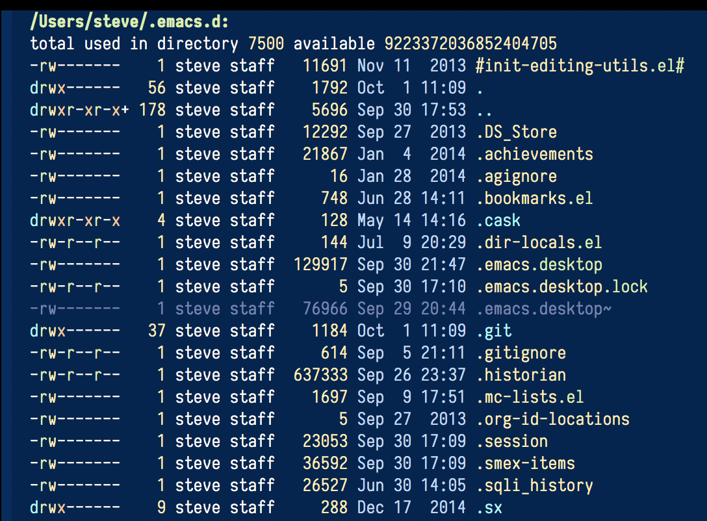

[](http://melpa.org/#/diredfl)
[](http://stable.melpa.org/#/diredfl)
[](https://github.com/purcell/diredfl/actions)
<a href="https://www.patreon.com/sanityinc"></a>

# Extra font lock rules for a more colourful dired

This is adapted from the extra font lock rules provided by Drew Adams'
`dired+` package, but published via a modern means, and with support
for older Emacsen removed.



## Installation

If you're an Emacs 24 user or you have a recent version of
`package.el` you can install `diredfl` from the
[MELPA](http://melpa.org) repository. The version of `diredfl` there
will always be up-to-date.

Enable `diredfl-mode` in all `dired-mode` buffers by calling or
customising `diredfl-global-mode` as desired.

## Customization

The colors can be easily customized. For example the following changes the colors to roughly mimic the `exa` shell command color palette:

```elisp
(setq
   diredfl-number     '(:foreground "#54A248")
   diredfl-file-name  '(:foreground "White")
   diredfl-dir-name   '(:foreground "#3DAEE9")
   diredfl-symlink    '(:foreground "#16A085" :background "#3A3B32")
   diredfl-date-time  '(:foreground "#1D95EC")
   diredfl-dir-priv   '(:foreground "#3DAEE9")
   diredfl-read-priv  '(:foreground "#FDBC4B")
   diredfl-write-priv '(:foreground "#B0362B")
   diredfl-exec-priv  '(:foreground "#55A649")
   diredfl-link-priv  '(:foreground "#16A085")
   diredfl-ignore-compressed-flag nil
   diredfl-compressed-file-suffix  'diredfl-file-suffix
   diredfl-compressed-file-name  '(:foreground "#C0392B")
)  
```

## Related packages

[dired-hacks](https://github.com/Fuco1/dired-hacks#dired-rainbow) also
contains some enhanced font-lock support for `dired`, but with
different goals from this package.

## About

Author: Steve Purcell <steve at sanityinc dot com>

Homepage: https://github.com/purcell/diredfl

<hr>

Author links:

[💝 Support this project and my other Open Source work](https://www.patreon.com/sanityinc)

[💼 LinkedIn profile](https://uk.linkedin.com/in/stevepurcell)

[✍ sanityinc.com](http://www.sanityinc.com/)

[🐦 @sanityinc](https://twitter.com/sanityinc)

